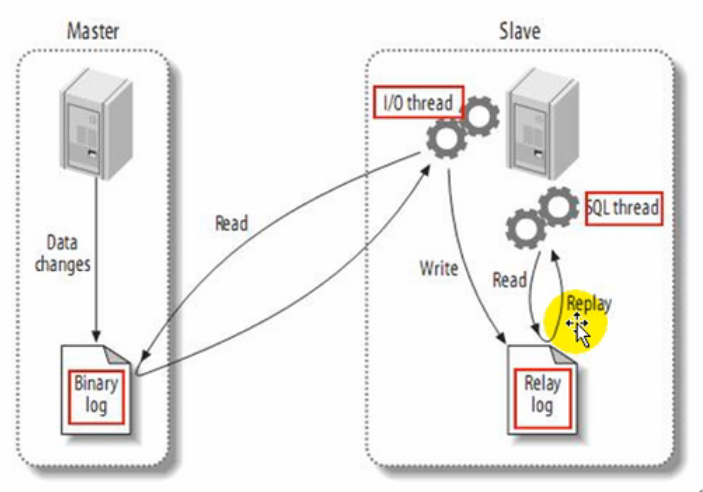

# MySQL主从复制的原理
MySQL主从复制的原理包括3个步骤，如下图所示：

1. master将改变记录到二进制日志（binary log）中，这些记录叫做二进制日志事件（binary log events）
2. slave将mater的二进制日志事件（binary log events）拷贝到它的中继日志（relay log）中
3. slave重放中继日志中的事件，将改变反映到它的数据