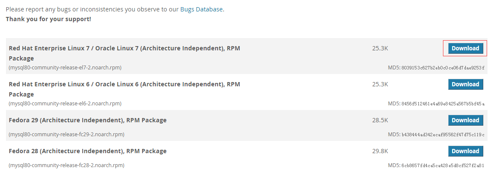

# CentOS 7使用yum安装MySQL 5.7
参考官方文档：[A Quick Guide to Using the MySQL Yum Repository](https://dev.mysql.com/doc/mysql-yum-repo-quick-guide/en/)

安装步骤：

1. 下载mysql的repo源
    在MySQL官网下载yum源，地址：[Download MySQL Yum Repository](https://dev.mysql.com/downloads/repo/yum/)
    - 打开MySQL官网的yum源下载页面（https://dev.mysql.com/downloads/repo/yum/），如下图所示：
        
    - 下载
    ```
    # wget -i https://dev.mysql.com/get/mysql80-community-release-el7-2.noarch.rpm
    ```
2. 安装yum源
    ```
    # rpm -ivh mysql80-community-release-el7-2.noarch.rpm
    ```
    安装这个包后，会获得两个mysql的yum repo源：
    - /etc/yum.repos.d/mysql-community.repo
    - /etc/yum.repos.d/mysql-community-source.repo
3. 指定需要安装的版本
    打开repo源`/etc/yum.repos.d/mysql-community.repo`，可以看到如下内容：
    ```
    ...
    # Enable to use MySQL 5.7
    [mysql57-community]
    name=MySQL 5.7 Community Server
    baseurl=http://repo.mysql.com/yum/mysql-5.7-community/el/7/$basearch/
    enabled=0
    gpgcheck=1
    gpgkey=file:///etc/pki/rpm-gpg/RPM-GPG-KEY-mysql

    [mysql80-community]
    name=MySQL 8.0 Community Server
    baseurl=http://repo.mysql.com/yum/mysql-8.0-community/el/7/$basearch/
    enabled=1
    gpgcheck=1
    gpgkey=file:///etc/pki/rpm-gpg/RPM-GPG-KEY-mysql
    ...
    ```

    上面的每一段中都有一个enabled标识，当值为1时，表示安装该版本，整个文件中只能有一个版本的enabled标识值可以为1。
    例如，要指定安装MySQL5.7版本，将5.7版本一段的enabled标识设置为1，然后将其他的段的enabled标识都设置为0：
    ```
    [mysql57-community]
    name=MySQL 5.7 Community Server
    baseurl=http://repo.mysql.com/yum/mysql-5.7-community/el/7/$basearch/
    enabled=1
    gpgcheck=1
    gpgkey=file:///etc/pki/rpm-gpg/RPM-GPG-KEY-mysql
    ```

    修改完后，通过以下命令核对已开启的MySQL安装版本：
    ```
    # yum repolist enabled | grep mysql
    ```
4. 安装MySQL
    通过以下命令安装MySQL：
    ```
    # yum install mysql-community-server
    ```
5. 启动MySQL
    ```
    # service mysqld start
    ```
6. 获取root用户的密码
    MySQL第一次启动后，会执行以下操作：
    - 初始化MySQL服务
    - 生成SSL证书
    - 安装并起用 validate_password 插件
        开启该插件后，会对密码的复杂度进行校验，如果想关闭该校验，可以使用root用户登录以后执行以下命令解除校验：
        ```
        # set global validate_password_policy=0;
        # set global validate_password_length=1;
        ```    
    - 创建'root'@'localhost'用户
        创建'root'@'localhost'用户的同时会生成一个随机密码并保存在错误日志中，可以通过以下命令查看密码：
        ```
        # grep 'temporary password' /var/log/mysqld.log
        ```
7. 修改root用户的密码
    ```
    # ALTER USER 'root'@'localhost' IDENTIFIED BY 'MyNewPass4!';
    ```