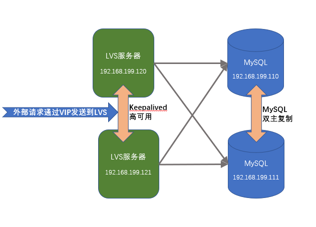

# lvs+keepalived+双主mysql实现负载均衡
lvs+keepalived+双主mysql实现负载均衡的架构如图所示：

软件安装清单如下所示：
| 服务器          | 安装软件        |
|-----------------|-----------------|
| 192.168.199.200 | 虚拟服务器IP    |
| 192.168.199.110 | MySQL，配置主   |
| 192.168.199.111 | MySQL，配置主   |
| 192.168.199.120 | LVS，keepalived |
| 192.168.199.121 | LVS，keepalived |

## 安装和配置LVS，Keepalived服务器
在服务器192.168.199.120和192.168.199.121上安装ipvsadm
1. 安装ipvsadm
    ```
    # yum install -y ipvsadm*
    ```
    安装完成后，使用命令`# ipvsadm -version`查看是否安装成功
2. 