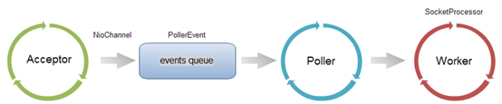
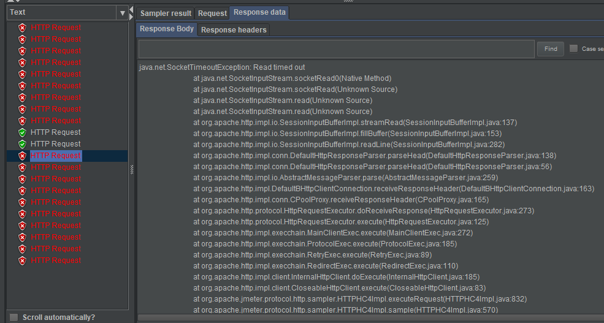

# 理解Tomcat的acceptCount、maxConnections、maxThreads

## Tomcat Connector的protocol：Nio、Bio、APR
Tomcat Connector在处理HTTP请求时，会使用不同的protocol。不同的Tomcat版本支持的protocol不同，其中最典型的protocol包括BIO、NIO和APR（Tomcat7中支持这3种，Tomcat8增加了对NIO2的支持，而到了Tomcat8.5和Tomcat9.0，则去掉了对BIO的支持）。

BIO是Blocking IO，顾名思义是阻塞的IO；NIO是Non-blocking IO，则是非阻塞的IO。而APR是Apache Portable Runtime，是Apache可移植运行库，利用本地库可以实现高可扩展性、高性能；Apr是在Tomcat上运行高并发应用的首选模式，但是需要安装apr、apr-utils、tomcat-native等包。

### 如何指定protocol
Connector使用哪种protocol，可以通过server.xml文件中的`<connector>`元素中的protocol属性进行指定，如下所示：
```
<Connector port="8080" protocol="HTTP/1.1"
               connectionTimeout="20000"
			   maxConnections="10"
			   acceptCount="2"
			   maxThreads="2"
               redirectPort="8443" />
```

指定的protocol取值及对应的协议如下：
+ HTTP/1.1：默认值，使用的协议与Tomcat版本有关
    >org.apache.coyote.http11.Http11Protocol：BIO
    >org.apache.coyote.http11.Http11NioProtocol：NIO
    >org.apache.coyote.http11.Http11Nio2Protocol：NIO2
    >org.apache.coyote.http11.Http11AprProtocol：APR
    如果没有指定protocol，则使用默认值HTTP/1.1，其含义如下：
    - 在Tomcat7中，自动选取使用BIO或APR（如果找到APR需要的本地库，则使用APR，否则使用BIO）；
    - 在Tomcat8中，自动选取使用NIO或APR（如果找到APR需要的本地库，则使用APR，否则使用NIO）。

### BIO/NIO有何不同
无论是BIO，还是NIO，Connector处理请求的大致流程是一样的：

在accept队列中接收连接（当客户端向服务器发送请求时，如果客户端与OS完成三次握手建立了连接，则OS将该连接放入accept队列）；在连接中获取请求的数据，生成request；调用servlet容器处理请求；返回response。为了便于后面的说明，首先明确一下连接与请求的关系：连接是TCP层面的（传输层），对应socket；请求是HTTP层面的（应用层），必须依赖于TCP的连接实现；一个TCP连接中可能传输多个HTTP请求。

在BIO实现的Connector中，处理请求的主要实体是JIoEndpoint对象。JIoEndpoint维护了Acceptor和Worker：Acceptor接收socket，然后从Worker线程池中找出空闲的线程处理socket，如果worker线程池没有空闲线程，则Acceptor将阻塞。其中Worker是Tomcat自带的线程池，如果通过配置了其他线程池，原理与Worker类似。

在NIO实现的Connector中，处理请求的主要实体是NIoEndpoint对象。NIoEndpoint中除了包含Acceptor和Worker外，还使用了Poller，处理流程如下图所示


Acceptor接收socket后，不是直接使用Worker中的线程处理请求，而是先将请求发送给了Poller，而Poller是实现NIO的关键。Acceptor向Poller发送请求通过队列实现（该队列的大小由*maxConnections*指定），使用了典型的生产者-消费者模式。在Poller中，维护了一个Selector对象；当Poller从队列中取出socket后，注册到该Selector中；然后通过遍历Selector，找出其中可读的socket，并使用Worker中的线程处理相应请求。与BIO类似，Worker也可以被自定义的线程池代替。

通过上述过程可以看出，在NIoEndpoint处理请求的过程中，无论是Acceptor接收socket，还是线程处理请求，使用的仍然是阻塞方式；但在“读取socket并交给Worker中的线程”的这个过程中，使用非阻塞的NIO实现，这是NIO模式与BIO模式的最主要区别（其他区别对性能影响较小，暂时略去不提）。而这个区别，在并发量较大的情形下可以带来Tomcat效率的显著提升：

目前大多数HTTP请求使用的是长连接（HTTP/1.1默认keep-alive为true），而长连接意味着，一个TCP的socket在当前请求结束后，如果没有新的请求到来（这里新的请求是指同一个socket下的新请求，即同一个客户端的新请求），socket不会立马释放，而是等timeout后再释放。如果使用BIO，“读取socket并交给Worker中的线程”这个过程是阻塞的，也就意味着在socket等待下一个请求或等待释放的过程中，处理这个socket的工作线程会一直被占用，无法释放；因此Tomcat可以同时处理的socket数目不能超过最大线程数（即*maxThreads*），性能受到了极大限制。而使用NIO，“读取socket并交给Worker中的线程”这个过程是非阻塞的，当socket在等待下一个请求或等待释放时，并不会占用工作线程，因此Tomcat可以同时处理的socket数目远大于最大线程数，并发性能大大提高。

## 理解acceptCount、maxConnections、maxThreads三个参数
再回顾一下Tomcat处理请求的过程：在accept队列中接收连接（当客户端向服务器发送请求时，如果客户端与OS完成三次握手建立了连接，则OS将该连接放入accept队列）；在连接中获取请求的数据，生成request；调用servlet容器处理请求；返回response。

相对应的，Connector中的几个参数功能如下：
+ acceptCount
    accept队列的长度；当accept队列中连接的个数达到acceptCount时，队列满，进来的请求一律被拒绝。默认值是100。
+ maxConnections
    Tomcat在任意时刻接收和处理的最大连接数。当Tomcat接收的连接数达到maxConnections时，Acceptor线程不会读取accept队列中的连接；这时accept队列中的线程会一直阻塞着，直到Tomcat接收的连接数小于maxConnections。如果设置为-1，则连接数不受限制。

    默认值与连接器使用的协议有关：NIO的默认值是10000，APR/native的默认值是8192，而BIO的默认值为maxThreads（如果配置了Executor，则默认值是Executor的maxThreads）。
    **这里说明的一点是：**在使用BIO协议时，因为是阻塞式的处理，所以*maxConnections*设置的比*maxThreads*大也是没有用的，因为每个被处理的连接都需要占用一个工作线程。
    
    在windows下，APR/native的maxConnections值会自动调整为设置值以下最大的1024的整数倍；如设置为2000，则最大值实际是1024。
+ maxThreads
    请求处理线程的最大数量。默认值是200（Tomcat7和8都是的）。如果该Connector绑定了Executor，这个值会被忽略，因为该Connector将使用绑定的Executor，而不是内置的线程池来执行任务。

    maxThreads规定的是最大的线程数目，并不是实际running的CPU数量；实际上，maxThreads的大小比CPU核心数量要大得多。这是因为，处理请求的线程真正用于计算的时间可能很少，大多数时间可能在阻塞，如等待数据库返回数据、等待硬盘读写数据等。因此，在某一时刻，只有少数的线程真正的在使用物理CPU，大多数线程都在等待；因此线程数远大于物理核心数才是合理的。

    换句话说，Tomcat通过使用比CPU核心数量多得多的线程数，可以使CPU忙碌起来，大大提高CPU的利用率。

## acceptCount、maxConnections、maxThreads三个参数的设置

#### maxThreads的设置
*maxThreads*的设置既与应用的特点有关，也与服务器的CPU核心数量有关。通过前面介绍可以知道，maxThreads数量应该远大于CPU核心数量；而且CPU核心数越大，maxThreads应该越大；应用中CPU越不密集（IO越密集），maxThreads应该越大，以便能够充分利用CPU。当然，maxThreads的值并不是越大越好，如果maxThreads过大，那么CPU会花费大量的时间用于线程的切换，整体效率会降低。

#### maxConnections的设置
*maxConnections*的设置与Tomcat的运行模式有关。如果tomcat使用的是BIO，那么maxConnections的值应该与maxThreads一致；如果tomcat使用的是NIO，*maxConnections*值应该远大于*maxThreads*。

#### acceptCount的设置
通过前面的介绍可以知道，虽然tomcat同时可以处理的连接数目是*maxConnections*，但服务器中可以同时接收的连接数为*maxConnections* + *acceptCount* 。*acceptCount*的设置，与应用在连接过高情况下希望做出什么反应有关系。
+ 当*acceptCount*设置过大时
    后面进入的请求等待时间会很长，如果这个时候应用的处理能力不够，导致很多连接在accept队列还未进入工作线程处理就超时，如果accept队列很长，很明显accept队列后面的连接请求也会等待很长的时间，还有可能会引起*羊群效应*，假设以下的场景：
    假设系统出现了高峰访问，导致系统处理能力不够，此时请求的响应可能需要等待较长的时间。此时用户很可能因为等待时间过长而不断刷新，或退出系统重新打开菜单等，这将不断增加系统的访问量，导致accept队列变得更长，accept队列中等待的连接又因为长时间得不到处理而不断的超时。
+ 当*acceptCount*设置过小时
    当瞬时请求量大的时候，很多请求因为超出*acceptCount*而被立即拒绝，client端出现很多connect timeout。如果这些被拒绝掉的请求可能是在worker线程的处理能力之内的（即work线程可以很快的处理掉这些请求），拒绝掉这些请求显然是不明智的，将导致用户体验下降。

因此要合理评估系统高峰的时候，worker线程池的大小。假设server平均每个请求耗时5ms，那么1个线程每秒rps可以有200，假设有4核cpu，那么每秒最大可以有800rps。现在假如有4个请求同时进来，那么4个线程将繁忙起来，也就是接下来的5ms中，这些线程时繁忙的。那么对于这个4核cpu的系统来说，最大的rps就是800。
如果限定所有请求在2秒内需要得到响应，那么*acceptCount*可以设置成 2 * 800，即2秒内可以处理完的请求就加入accept队列，再多的请求就直接拒绝了。    

### 测试acceptCount、maxConnections、maxThreads三个参数值的效果
#### 测试的操作步骤
1. 设置Tomcat参数
    设置Tomcat的参数，如下所示：
    + *protocol* = org.apache.coyote.http11.Http11NioProtocol
        指定使用NIO，这里不能使用BIO，使用BIO将使得*maxConnections*设置不起作用
    + *acceptCount* = 2
    + *maxConnections* = 10
    + *maxThreads* = 2
    + *connectionTimeout* = 20000
    
    完整的配置如下所示（tomcat server.xml配置参数）
    ```
    <Connector port="8080" protocol="org.apache.coyote.http11.Http11NioProtocol" acceptCount="2" maxConnections="10" maxThreads="2"
               connectionTimeout="20000"
               redirectPort="8443" />
    ```
2. 请求处理
    请求处理很简单，就是休眠20秒，Servlet代码如下所示：
    ```
    protected void doGet(HttpServletRequest request, HttpServletResponse response) throws ServletException, IOException {
        try {
            InputStream is = request.getInputStream();
            System.out.println(new Date()+":"+is+"开始");
            Thread.sleep(20000);
            System.out.println(new Date()+":"+is+"结束");
        } catch (InterruptedException e) {
            // TODO Auto-generated catch block
            e.printStackTrace();
        }
    }
    ```
3. 使用JMeter测试
    JMeter设置线程数20，连接超时时间10s，响应超时时间30s
4. 测试结果
    第1秒：8个请求得到响应数据：Connection refused connect
    第20秒：2个请求正常响应
    第30秒：剩余10个请求得到响应数据：Readtimed out

#### 测试结果分析
测试结果如下图所示：

+ 第1秒：8个请求得到响应数据：Connection refused connect
    这是因为Tomcat在一个时刻最多只能接受 *maxConnections* + *acceptCount* 个请求，即12个，所以，并发的20个请求中，将有8个请求直接被拒绝。
+ 第20秒：2个请求正常响应
+ 第30秒：剩余10个请求得到响应数据：Readtimed out
    因为JMeter设置的响应超时时间为30s，所以接受的12个请求中，除了最开始处理的2个请求，剩余10个请求最快也要40s才能处理完成，显然会超时。    

```
D:\DevTools\redis 3.2>netstat -ano | findstr "8082"
  TCP    0.0.0.0:8082           0.0.0.0:0              LISTENING       5452
  TCP    127.0.0.1:8082         127.0.0.1:57434        CLOSE_WAIT      5452
  TCP    127.0.0.1:8082         127.0.0.1:57435        CLOSE_WAIT      5452
  TCP    127.0.0.1:8082         127.0.0.1:57440        CLOSE_WAIT      5452
  TCP    127.0.0.1:8082         127.0.0.1:57441        CLOSE_WAIT      5452
  TCP    127.0.0.1:8082         127.0.0.1:57442        CLOSE_WAIT      5452
  TCP    127.0.0.1:8082         127.0.0.1:57443        CLOSE_WAIT      5452
  TCP    127.0.0.1:8082         127.0.0.1:57444        CLOSE_WAIT      5452
  TCP    127.0.0.1:8082         127.0.0.1:57445        CLOSE_WAIT      5452
  TCP    127.0.0.1:57434        127.0.0.1:8082         FIN_WAIT_2      10308
  TCP    127.0.0.1:57435        127.0.0.1:8082         FIN_WAIT_2      10308
  TCP    127.0.0.1:57440        127.0.0.1:8082         FIN_WAIT_2      10308
  TCP    127.0.0.1:57441        127.0.0.1:8082         FIN_WAIT_2      10308
  TCP    127.0.0.1:57442        127.0.0.1:8082         FIN_WAIT_2      10308
  TCP    127.0.0.1:57443        127.0.0.1:8082         FIN_WAIT_2      10308
  TCP    127.0.0.1:57444        127.0.0.1:8082         FIN_WAIT_2      10308
  TCP    127.0.0.1:57445        127.0.0.1:8082         FIN_WAIT_2      10308
```

四 看连接状态
1.连接数
假设Tomcat接收http请求的端口是8083，则可以使用如下语句查看连接情况：

netstat –nat | grep 8083
1
在这里插入图片描述
可以看出，有一个连接处于listen状态，监听请求；除此之外，还有4个已经建立的连接（ESTABLISHED）和2个等待关闭的连接（CLOSE_WAIT）。