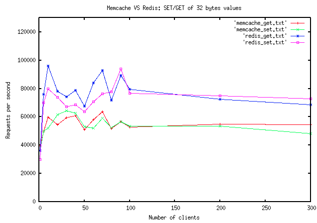

# redis-benchmark

## 其他人的性能测试结果


## 测试记录
在 i7 8G 的笔记本上安装VMWare虚拟机，开启三台虚拟机，进行测试：
```
[root@localhost redis-5.0.5]#  ./src/redis-benchmark -h 192.168.199.130 -p 6379 -a 123456 -c 1 -n 100000 -d 256 -r 10000 -e -q
PING_INLINE: 2064.20 requests per second
PING_BULK: 2072.62 requests per second
SET: 2460.87 requests per second
GET: 2100.62 requests per second
INCR: 2475.92 requests per second
LPUSH: 2456.28 requests per second
RPUSH: 2462.51 requests per second
LPOP: 2475.25 requests per second
RPOP: 2456.94 requests per second
SADD: 1999.92 requests per second
HSET: 2459.72 requests per second
SPOP: 2094.72 requests per second
LPUSH (needed to benchmark LRANGE): 2476.11 requests per second
LRANGE_100 (first 100 elements): 1263.15 requests per second
LRANGE_300 (first 300 elements): 681.17 requests per second
LRANGE_500 (first 450 elements): 491.09 requests per second
LRANGE_600 (first 600 elements): 469.64 requests per second
MSET (10 keys): 1090.83 requests per second

[root@localhost redis-5.0.5]#  ./src/redis-benchmark -h 192.168.199.130 -p 6379 -a 123456 -c 50 -n 100000 -d 256 -r 10000 -e -q
PING_INLINE: 31084.86 requests per second
PING_BULK: 31328.32 requests per second
SET: 25826.45 requests per second
GET: 30826.14 requests per second
INCR: 22799.82 requests per second
LPUSH: 19809.83 requests per second
RPUSH: 18422.99 requests per second
LPOP: 20173.49 requests per second
RPOP: 20470.83 requests per second
SADD: 23741.69 requests per second
HSET: 20898.64 requests per second
SPOP: 24912.80 requests per second
LPUSH (needed to benchmark LRANGE): 20088.39 requests per second
LRANGE_100 (first 100 elements): 6811.53 requests per second
LRANGE_300 (first 300 elements): 3324.58 requests per second
LRANGE_500 (first 450 elements): 2122.20 requests per second
LRANGE_600 (first 600 elements): 1404.30 requests per second
MSET (10 keys): 10536.30 requests per second
```