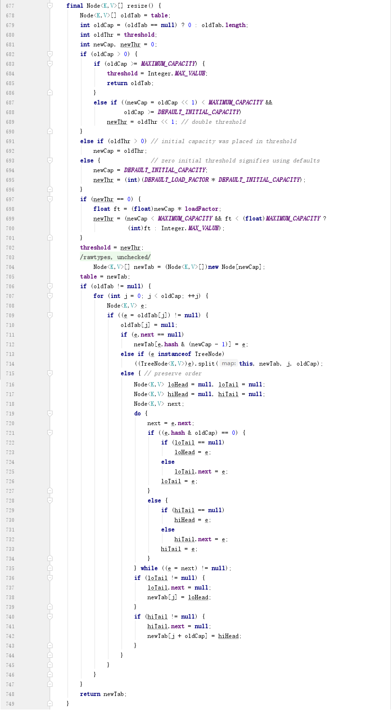
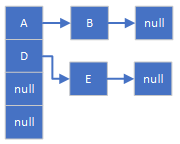

# HashMap

## JDK1.8 HashMap源码解析

### JDK1.8 HashMap putVal源码解析
putVal的主要逻辑为：
1. 获取key的hash散列值，设为j
2. 在HashMap的<code>table[j]</code>链表中查找与当前key相同的key是否已经存在，如果已经存在，则更新已存在的key的值；否则，转3
3. 新增一个元素节点并追加到链表末尾。
4. 检查当前链表的长度是否达到<code>TREEIFY_THRESHOLD</code>（值为8），如果未达到，将结束；否则，转5
5. 检查当前的<code>table</code>长度是否达到<code>MIN_TREEIFY_CAPACITY</code>（值为64），如果还未达到，将执行resize方法对table进行扩容，否则，转6
6. 执行<code>treeifyBin</code>方法将当前的链表转换为一棵红黑树。

putVal方法的源码如下所示：
```
/**
* Implements Map.put and related methods
*
* @param hash hash for key
* @param key the key
* @param value the value to put
* @param onlyIfAbsent if true, don't change existing value
* @param evict if false, the table is in creation mode.
* @return previous value, or null if none
*/
final V putVal(int hash, K key, V value, boolean onlyIfAbsent,
                boolean evict) {
    Node<K,V>[] tab; Node<K,V> p; int n, i;
    if ((tab = table) == null || (n = tab.length) == 0)        
        n = (tab = resize()).length;                    // 初始化HashMap的table
    if ((p = tab[i = (n - 1) & hash]) == null)          // (n - 1) & hash = hash % n，即当前key的hash散列值
        tab[i] = newNode(hash, key, value, null);
    else {
        Node<K,V> e; K k;
        if (p.hash == hash &&
            ((k = p.key) == key || (key != null && key.equals(k))))
            e = p;
        else if (p instanceof TreeNode)
            e = ((TreeNode<K,V>)p).putTreeVal(this, tab, hash, key, value);
        else {
            // 这里对key的hash散列值所在的链表进行遍历，查找当前put的key是否已存在，如果存在，直接更新即可。
            for (int binCount = 0; ; ++binCount) {
                if ((e = p.next) == null) {                     // 如果在当前链表中未找到相同的key，表示当前的key在HashMap中还不存在，则新建一个HashMap节点。
                    p.next = newNode(hash, key, value, null);
                    // 如果当前链表的元素个数超过了 TREEIFY_THRESHOLD 阈值（值为8），HashMap将当前的链表转换为一颗红黑树
                    if (binCount >= TREEIFY_THRESHOLD - 1) // -1 for 1st
                        treeifyBin(tab, hash);                  
                    break;
                }
                if (e.hash == hash &&
                    ((k = e.key) == key || (key != null && key.equals(k))))
                    break;
                p = e;
            }
        }
        if (e != null) { // existing mapping for key
            V oldValue = e.value;
            if (!onlyIfAbsent || oldValue == null)
                e.value = value;
            afterNodeAccess(e);
            return oldValue;
        }
    }
    ++modCount;
    if (++size > threshold)
        resize();
    afterNodeInsertion(evict);
    return null;
}
```

### JDK1.8 HashMap resize扩容源码解析
HashMap的resize方法用于对HashMap进行扩容，扩容的方式
```
/**
* Initializes or doubles table size.  If null, allocates in
* accord with initial capacity target held in field threshold.
* Otherwise, because we are using power-of-two expansion, the
* elements from each bin must either stay at same index, or move
* with a power of two offset in the new table.
* 上面最后一句的意思是，因为HashMap的table每次都按一倍扩容，所以，在原oldTab[i]所在链表上的元素，迁移到扩容后的newTab后，要么落在newTab[i]所在的链表上，要么落在newTab[i+oldCap]所在的链表上。
* @return the table
*/
final Node<K,V>[] resize() {
    Node<K,V>[] oldTab = table;
    int oldCap = (oldTab == null) ? 0 : oldTab.length;
    int oldThr = threshold;
    int newCap, newThr = 0;
    if (oldCap > 0) {
        if (oldCap >= MAXIMUM_CAPACITY) {
            threshold = Integer.MAX_VALUE;
            return oldTab;
        }
        else if ((newCap = oldCap << 1) < MAXIMUM_CAPACITY &&
                    oldCap >= DEFAULT_INITIAL_CAPACITY)
            newThr = oldThr << 1; // double threshold
    }
    else if (oldThr > 0) // initial capacity was placed in threshold
        newCap = oldThr;
    else {               // zero initial threshold signifies using defaults
        newCap = DEFAULT_INITIAL_CAPACITY;
        newThr = (int)(DEFAULT_LOAD_FACTOR * DEFAULT_INITIAL_CAPACITY); 
    }
    if (newThr == 0) {
        float ft = (float)newCap * loadFactor;
        newThr = (newCap < MAXIMUM_CAPACITY && ft < (float)MAXIMUM_CAPACITY ?
                    (int)ft : Integer.MAX_VALUE);
    }
    threshold = newThr;
    @SuppressWarnings({"rawtypes","unchecked"})
    Node<K,V>[] newTab = (Node<K,V>[])new Node[newCap];
    table = newTab;
    if (oldTab != null) {
        for (int j = 0; j < oldCap; ++j) {
            Node<K,V> e;
            if ((e = oldTab[j]) != null) {
                oldTab[j] = null;
                if (e.next == null)
                    newTab[e.hash & (newCap - 1)] = e;
                // TODO: 这里等待解析
                else if (e instanceof TreeNode)
                    ((TreeNode<K,V>)e).split(this, newTab, j, oldCap);
                else { // preserve order
                    Node<K,V> loHead = null, loTail = null;
                    Node<K,V> hiHead = null, hiTail = null;
                    Node<K,V> next;
                    do {
                        next = e.next;
                        // 因为HashMap的table每次都按一倍扩容（即newCap = 2 * oldCap），所以，元素e，迁移到扩容后的newTab后，要么落在newTab[j]所在的链表上，要么落在newTab[j+oldCap]所在的链表上。
                        // 这里的loTail和loHead就是扩容后新表newTab[j]关联链表的表尾和表头；  lo -> low
                        // hiTail和hiHead就是扩容后新表newTab[j+oldCap]关联链表的表尾和表头； hi -> high
                        // 下面分析两个问题：
                        //      1）为什么当e.hash & oldCap == 0的时候，e.hash在新表newTab上的散列值依然是j？即元素e将加入newTab[j]关联的链表（loHead和loTail指向的链表）；
                        //      2）为什么当e.hash & oldCap != 0的时候，e.hash在新表newTab上的散列值是oldCap + j？即元素e将加入newTab[oldCap + j]关联的链表（hiHead和hiTail指向的链表）；
                        //
                        // 先分析第一个问题：为什么e.hash & oldCap == 0的时候，e.hash在新表newTab上的散列值依然是j？
                        // 当e.hash & oldCap == 0时，可以推导出，e.hash % newCap == e.hash % oldCap，下面是推导过程：
                        //      因为newCap和oldCap是2的幂次方，所以有：e.hash % oldCap == e.hash & (oldCap - 1)，   e.hash % newCap == e.hash & (newCap - 1)
                        //      如果要让e.hash % oldCap == e.hash % newCap，只要 e.hash & (oldCap - 1) == e.hash & (newCap - 1)
                        //      e.hash & (newCap - 1) - e.hash & (oldCap - 1) 
                        //          = e.hash & (oldCap * 2 - 1) - e.hash & (oldCap - 1) 
                        //          = e.hash & (oldCap * 2) - e.hash & oldCap - e.hash & 1 + e.hash & 1 
                        //          = e.hash & (oldCap * 2 - oldCap) 
                        //          = e.hash & oldCap
                        // 所以，只要 e.hash & oldCap == 0，就能保证 e.hash % newCap == e.hash % oldCap，而HashMap的hash散列使用的取模，所以也就意味着e.hash在扩容后的散列值与扩容前是相等的，即在oldTab和newTab上是属于相同的下标所在的链表（即loHead和loTail所指的那个链表）
                        // 下面就是将当前的元素e挂到newTab所在链表的表尾。（JDK1.7及之前的版本复制到扩容后的新表时，是反向挂的，比如：原表的链表是A->B，扩容后的新链表会变成B->A。可参考本文的“JDK1.7及之前的版本，HashMap在并发的情况下扩容出现死锁”一节，这样可以避免产生循环链的问题） 
                        // 
                        // 分析第二个问题：为什么e.hash & oldCap != 0的时候，e.hash在新表newTab上的散列值是oldCap + j？
                        // 要证明这个问题，只需要证明 e.hash % newCap == oldCap + j 即可。下面是推导过程：
                        //      e.hash % newCap 
                        //          = e.hash % (oldCap * 2) 
                        //          = e.hash & (oldCap * 2 - 1)                         // 因为oldCap是2的幂次方，取模就是对oldCap - 1执行与运算。
                        //          = e.hash & (oldCap * 2) - e.hash & 1    
                        //          = e.hash & (oldCap + oldCap) - e.hash & 1
                        //          = e.hash & oldCap - e.hash & 1 + e.hash & oldCap 
                        //          = e.hash & (oldCap - 1) + oldCap                    // 因为e.hash & oldCap != 0，且oldCap是2的幂次方，所以，肯定有 e.hash & oldCap == oldCap（使用二进制形式就一目了然了，因为oldCap除了最高位为1，其余的位都是0）
                        //          = e.hash % oldCap + oldCap                                  // 这里利用了 e.hash % oldCap == e.hash & (oldCap -1)
                        //          = j + oldCap                                         // e.hash % oldCap == j 是在就表oldTab中就有的条件
                        if ((e.hash & oldCap) == 0) {
                            if (loTail == null)
                                loHead = e;
                            else
                                loTail.next = e;
                            loTail = e;
                        }
                        else {
                            if (hiTail == null)
                                hiHead = e;
                            else
                                hiTail.next = e;
                            hiTail = e;
                        }
                    } while ((e = next) != null);
                    if (loTail != null) {
                        loTail.next = null;
                        newTab[j] = loHead;
                    }
                    if (hiTail != null) {
                        hiTail.next = null;
                        newTab[j + oldCap] = hiHead;
                    }
                }
            }
        }
    }
    return newTab;
}
```



## JDK1.7及之前的版本，HashMap在并发的情况下扩容出现死锁
JDK1.7及之前的版本，HashMap在并发情况下如果发生扩容，有可能会导致死锁。以下的讲解和代码都是基于JDK1.7。
JDK1.7及之前的版本中，HashMap保存数据的结构是数组+链表，数组中的每个元素为链表头。如下图所示：

其中，数组中包含两个非null元素A、D和另外两个null元素，元素A、B的key的hash散列值相同，组成一个链表；元素D、E的key的hash散列值相同，组成了另一个链表。
HashMap在并发的情况下扩容出现死锁的场景如下的时序图所示：


### 测试
使用如下的代码测试：
```
import java.util.HashMap;
import java.util.Map;
import java.util.UUID;

public class TestDeadLock extends Thread {

    private Map<String, String> map;

    public TestDeadLock(Map<String, String> map) {
        this.map = map;
    }

    @Override
    public void run() {
        for (int i = 0; i < 50000; i++) {
            String key = UUID.randomUUID().toString();
            map.put(key, key);
            System.out.printf("Thread %1$s Running and have put %2$s entry[key=%3$s].\n", this.getId(), i, key);
        }
    }

    public static void main(String[] args) {
        Map<String, String> map = new HashMap();
        for (int i = 0; i < 3; i++) {
            new TestDeadLock(map).start();
        }
    }
}
```
最终的结果是，运行一段时间后，控制台不再打印新的内容，打印结果如下所示：
```
Thread 14 Running and have put 0 entry[key=51ffaa16-6576-4136-a7f8-f5a9603fc970].
Thread 13 Running and have put 0 entry[key=9a6b2100-28ff-435c-8b99-5eefa446158c].
Thread 12 Running and have put 0 entry[key=9c0cb41e-9db6-4a8f-9d4f-54e0882ae440].
Thread 13 Running and have put 1 entry[key=31004fa7-18f0-4c5f-ae3c-f2a12682169f].
....    这里省略中间的打印内容
Thread 13 Running and have put 1492 entry[key=b5f74af3-9d99-45ce-89a8-5ddbe390feb0].
Thread 13 Running and have put 1493 entry[key=ffc27228-a1e9-407d-b957-2583caa94804].
Thread 13 Running and have put 1494 entry[key=2fc4275d-5c25-4946-a3b1-401e951ba69f].
Thread 13 Running and have put 1495 entry[key=24632f8f-6f9e-4310-884f-6000348d281b].
Thread 13 Running and have put 1496 entry[key=8eb0e62f-4891-4fce-aa9e-25bc102220d2].
Thread 13 Running and have put 1497 entry[key=57a929be-67f7-4f33-beee-d45770e7dfaa].
```

导出当前的线程堆栈信息如下所示：
```
> jps -l
12512 TestDeadLock

> jstack 12512
... 这里省略其他的线程堆栈信息
"Thread-2" prio=6 tid=0x000000000d54d000 nid=0x4c4 runnable [0x000000000e31f000]
   java.lang.Thread.State: RUNNABLE
        at java.util.HashMap.put(HashMap.java:494)
        at TestDeadLock.run(TestDeadLock.java:17)

"Thread-1" prio=6 tid=0x000000000d54c000 nid=0x5864 runnable [0x000000000e21f000]
   java.lang.Thread.State: RUNNABLE
        at java.util.HashMap.put(HashMap.java:494)
        at TestDeadLock.run(TestDeadLock.java:17)

"Thread-0" prio=6 tid=0x000000000d54e800 nid=0x35a0 runnable [0x000000000e11e000]
   java.lang.Thread.State: RUNNABLE
        at java.util.HashMap.put(HashMap.java:494)
        at TestDeadLock.run(TestDeadLock.java:17)

```
可以看到，三个线程都停留在HashMap的第494行，该行代码如下所示：
```
public V put(K key, V value) {
    if (table == EMPTY_TABLE) {
        inflateTable(threshold);
    }
    if (key == null)
        return putForNullKey(value);
    int hash = hash(key);
    int i = indexFor(hash, table.length);
    for (Entry<K,V> e = table[i]; e != null; e = e.next) {
        Object k;
        if (e.hash == hash && ((k = e.key) == key || key.equals(k))) {
            V oldValue = e.value;
            e.value = value;
            e.recordAccess(this);
            return oldValue;
        }
    }

    modCount++;
    addEntry(hash, key, value, i);
    return null;
}
```

### 死锁的解决办法
HashMap本身是不支持并发操作的，导致死锁是使用不当引起的，所以，如果存在并发访问的情况，应该使用ConcurrentHashMap替代HashMap

## HashMap计算hash散列值的时候使用位运算取代取模运算效率真的高吗？
HashMap计算hash散列值的时候使用位运算取代取模运算效率真的高吗？
使用测试代码测试如下：
```
public static void main(String[] args) {
    int r1 = 0, r2 = 0;
    long times = 1000000000L;
    int num = Integer.MAX_VALUE;
    int mod = 7654;
    long startTime = System.currentTimeMillis();
    for (long i = 0; i < times; i++) {
        r1 = num % mod;
    }
    long modCostTime = System.currentTimeMillis() - startTime;
    startTime = System.currentTimeMillis();
    for (long i = 0; i < times; i++) {
        r2 = num & (mod - 1);
    }
    long bitCostTime = System.currentTimeMillis() - startTime;
    System.out.printf("r1=%1$s, r2=%2$s, modCostTime=%3$s, bitCostTime=%4$s", r1, r2, modCostTime, bitCostTime);
}
```
测试结果如下所示，10亿次计算，时间相差在35毫秒：
```
r1=867, r2=7653, modCostTime=386, bitCostTime=351
```