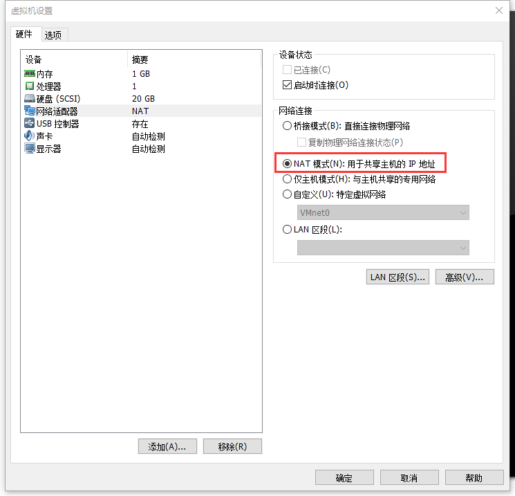
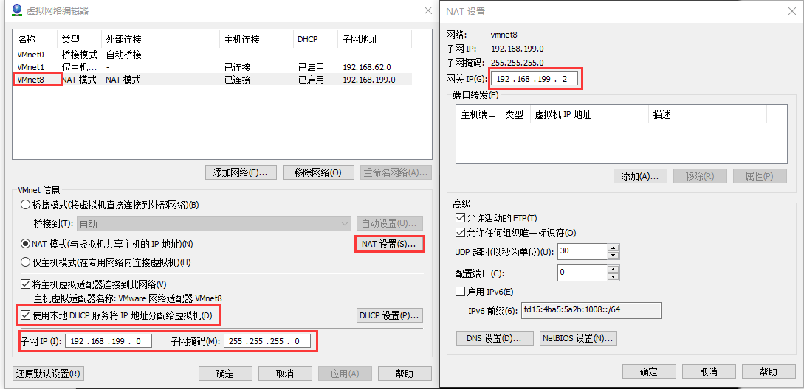
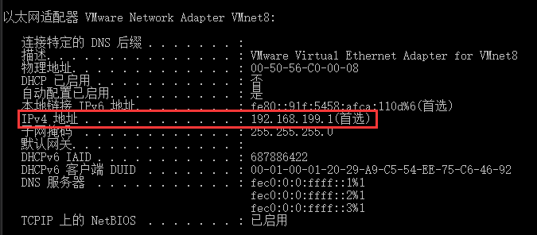
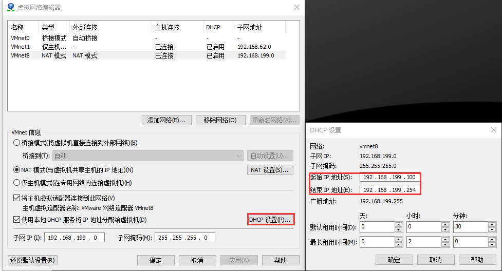
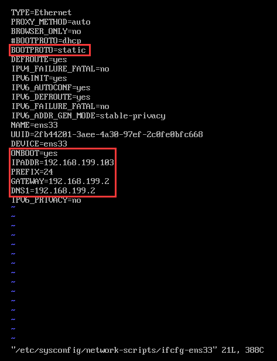
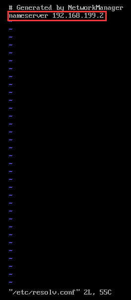

# 概述
为了测试多机环境，在一台移动办公的电脑上会安装多个虚拟机，并且会将所有虚拟机设置固定的IP地址，他们在同一个局域网中。
但是移动办公可能面临宿主机（即物理主机）经常会更换到不同的局域网。如果虚拟机使用桥接网络模式，和宿主机同网段，显然，宿主机切换到一个不同的网段，所有虚拟机都必须重新配置网络地址，将是一件非常麻烦的事。
这里就是讲述宿主机在不同网段的网络中进行切换时，如何让虚拟机的局域网网段保持不变。

# 步骤
1. 将虚拟机的网络适配器设置为“NAT模式”，如下图所示：    
    
2. 设置VMware的VMnet8虚拟网卡，如下图所示：    
        

    <b>必须注意的两点是</b>：
    1. 点击“NAT设置...”按钮，打开图片右侧部分窗口后，“网关IP”的最后一位小数不能设置为1，因为VMnet8虚拟网卡自己会分配一个IP地址，该IP地址就是1结尾，在宿主机使用`ipconfig /all`命令查看VMnet8的网络配置如下图所示：    
        
    2. 点击“DHCP设置...”按钮，打开下面图片中右侧部分窗口后，可以设置DHCP可以自动分配的IP网段。     
        
    

    最后，VMnet8的设置不是针对某一台虚拟机，将会对所有选择NAT模式的虚拟机都生效，所以，只需要设置一次即可，不需要针对所有NAT模式的虚拟机都设置一次。

3. 为虚拟机设置静态IP和域名解析，如下图所示：   
       
    注意：网关和DNS都配置成VMnet8中配置的网关地址    
        
    注意：域名解析服务地址配置成VMnet8中配置的网关地址，配置的地方是 /etc/resolv.conf  文件