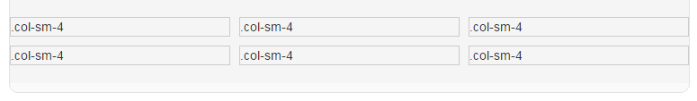

[Back](index.md)

# Bootstrap Grid System

# Introduction

Bootstrap的格栅布局介绍

# Content Catalogue <a id="≡">≡</a>

- [Grid System Introduction](#GSI)
- [Grid options](#GO)
- [Grid System应用于布局](#GSAL)
    + [应用Grid System设置多列之间等间隔](#GSAL-EG)


# Content 

## Grid System Introduction <a id="GSI">[≡](#≡)</a>

Grid systems are used for creating page layouts through a series of rows and columns that house your content. Here's how the Bootstrap grid system works:   

- Rows must be placed within a `.container` (fixed-width) or `.container-fluid` (full-width) for proper alignment and padding.
- Use rows to create horizontal groups of columns.
- Content should be placed within columns, and only columns may be immediate children of rows.
- Predefined grid classes like `.row` and `.col-xs-4` are available for quickly making grid layouts. Less mixins can also be used for more semantic layouts.
- Columns create gutters (gaps between column content) via padding. That padding is offset in rows for the first and last column via negative margin on `.rows`.
- The negative margin is why the examples below are outdented. It's so that content within grid columns is lined up with non-grid content.
- Grid columns are created by specifying the number of twelve available columns you wish to span. For example, three equal columns would use three .col-xs-4.
- If more than 12 columns are placed within a single row, each group of extra columns will, as one unit, wrap onto a new line.
- Grid classes apply to devices with screen widths greater than or equal to the breakpoint sizes, and override grid classes targeted at smaller devices. Therefore, e.g. applying any .col-md-* class to an element will not only affect its styling on medium devices but also on large devices if a .col-lg-* class is not present.

## Grid options <a id="GO">[≡](#≡)</a>

The table bellow shows bootstrap grid system work across multiple devices with breakpoint sizes(dev means devices).

|      Title      |     Extra small dev     | Small dev Tablets  |    Medium dev    | Large dev Desktops |
|                 |      Phones(<768px)     |     (>=768px)      | Desktop(>=992px) |     (>=1200px)     |
|-----------------|-------------------------|--------------------|------------------|--------------------|
| Grid behavior   | Horizontal at all times | Collapsed to start | ...              | ...                |
|                 |                         | horizontal above   |                  |                    |
|                 |                         | breakpoints        |                  |                    |
| Container Width | None(auto)              | 750px              | 970px            | 1170px             |
| Class prefix    | .col-xs-                | .col-ms-           | .col-md-         | .col-lg-           |
| Columns count   | 12                      | 12                 | 12               | 12                 |
| Column width    | Auto                    | ~62px              | ~81px            | ~97px              |
| Gutter width    | 30px (15px on each      | ...                | ...              | ...                |
|                 | side of a column)       |                    |                  |                    |
| Nestable        | Yes                     | ...                | ...              | ...                |
| Offsets         | Yes                     | ...                | ...              | ...                |
| Column ordering | Yes                     | ...                | ...              | ...                   |

**_说明_**：
1. Container width
    容器宽度，这里是指`.container`的容器宽度，因为`.container-fluid`的容器宽度与视口无关，只与父容器的宽度有关。
    `.container`容器的宽度，会在不同的视口宽度下被设置为不同的宽度，参见[Container](overview.html#C)一节。

2. Column width
    列宽，这里是指列宽的临界值（breakpoints），即当`.container`的宽度变窄时，每一列的宽度也会跟着变窄，但当宽度达到该临界值时，一行`.row`将无法容纳原来的那些列，这将导致后面的列移到下一行，使得前面的列可以有更宽的空间。

3. Gutter width
    间隙宽度，是指两列之间的间隔宽度。Bootstrap的Grid System默认为每列设置了左右"15px"的padding值，相当于默认的间隙有"30px"宽。


## Grid System应用于布局 <a id="GSAL">[≡](#≡)</a>

### 应用Grid System设置多列之间等间隔  <a id="GSAL-EG">[≡](#≡)</a>

#### 应用场景描述

很多时候需要这样一种布局：

1. 一行中按顺序排列着多列格子，每个格子之间存在固定宽度的间隔。
2. 在一行的第一个格子的开头 和 最后一个格子的末尾没有间隔
3. 响应式，即随着视口宽度的变化，格子的宽度应该能自适应的跟着变化
4. 当视口的宽度发生变化时，格子之间的间隔宽度不变。

#### 实现原理

1. 首先利用Bootstrap的格栅布局，很容易实现应用场景中的第1、3条

2. 实现第2条和第4条

    参考Bootstrap对Grid System介绍中的一句描述：   
    Columns create gutters (gaps between column content) via padding. That padding is offset in rows for the first and last column via negative margin on `.rows`."

    从这里可以知道，Bootstrap推荐使用分别设置`.col`的padding和`.row`的负边距来达到等间隔的设置。
    这种方式的原理，可以参考[CSS负边距的理解](../css/layout/负边距的理解.md)一文。其核心是：块状元素在设置了负边距后，会增加宽度，如设置一个左负边距，块元素的左侧会变宽，从而抵消第一个`.col`元素左侧的padding空隙。

#### 实现代码和效果

[完整的代码请看这里](demos/grid-system.html#demo1)
```
<style type="text/css">
.col {
    padding-left:10px; padding-right:0; padding-top:10px;
}
.col div {
    border:solid 1px #CCC
}
</style>
<div class="container-fluid" style="padding:20px 0">
    <div class="row" style="margin-left:-10px; margin-right:0;">
        <div class="col-sm-4 col">
            <div>.col-sm-4</div>
        </div>
        <div class="col-sm-4 col">
            <div>.col-sm-4</div>
        </div>
        <div class="col-sm-4 col">
            <div>.col-sm-4</div>
        </div>
        <div class="col-sm-4 col">
            <div>.col-sm-4</div>
        </div>
        <div class="col-sm-4 col">
            <div>.col-sm-4</div>
        </div>
        <div class="col-sm-4 col">
            <div>.col-sm-4</div>
        </div>
    </div>
</div>
```
上面的代码实现的效果如下图所示，实现了一个3列格子的效果，两个格子之间间隔"10px"的间距：


其核心代码为：

1. `.row`上设置左负边距`margin-left:-10px;`，因为bootstrap的css默认会给`.row`设置一个`margin-right`边距，所以需要覆盖该默认设置，将其设置为`margin-right:0;`
2. 每列上设置一个左边距`padding-left:10px;`，用于设置两列之间的固定间隔。


