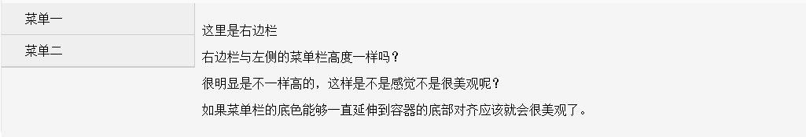

[Back](index.md)

# 侧边栏-分栏高度自动相等

# Introduction

纯CSS实现侧边栏/分栏高度自动相等.

# Content Catalogue <a id="≡">≡</a>

- [为何要分栏高度一致？](#Tag1)
- [纯CSS实现侧边栏/分栏高度自动相等](#Tag2)

# Content

## 为何要分栏高度一致？ <a id="Tag1">[≡](#≡)</a>

分栏高度一致的目的是更加美观。当分栏的高度不一致，且两个分栏之间有分隔线的时候，展示的效果将不是很美观，如下图所示：


由此可见，实现分栏高度的一致性还是很有必要的。

## 负边距实现侧边栏/分栏高度自动相等  <a id="Tag2">[≡](#≡)</a>

负边距实现侧侧边栏/分栏高度自动相等方法是一种最简洁的纯CSS实现方式。主要利用负边距的原理，核心的代码为：    
```
margin-bottom:-3000px; 
padding-bottom:3000px;
```
再配合父标签的`overflow:hidden`属性即可实现高度自动相等的效果。其原理，请参考[负边距的理解](负边距的理解.md)一文。

下面是实现的Html代码和效果图（[完整的代码](demos/侧边栏-分栏高度自动相等.html#demo2))：  
```
<div style="overflow: hidden;">
    <div class="left">
        <ul>
            <li>菜单一</li>
            <li>菜单二</li>
        </ul>
    </div>
    <div class="right">
        <p>这里是右边栏</p>
        <p>现在侧边栏和分栏的高度是不是一样的呢？</p>
        <p>真的一样高了，美观多了。怎么做到的呢？</p>
        <p>给侧边栏加上 margin-bottom:-2000px; padding-bottom:-2000，然后给父容器加上 overflow:hidden就可以啦！</p>
    </div>
</div>

其中核心的CSS代码为：
.left {
    width: 245px;
    float: left;     
    margin-bottom: -2000px;
    padding-bottom: 2000px;    
}
.right {
    margin-left: 245px;
    padding: 10px;
}
```

效果图：
![images/侧边栏-分栏高度自动相等-2.png]