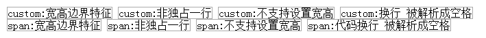
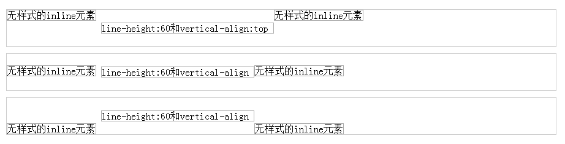

[Back](index.md)

# 深入理解display属性

# Introduction

display属性在网页布局中非常常见，不同的display属性值对元素的宽度和高度以及布局的占位有着非常重要的影响。但经常用到的仅仅是block、inline-block、inline和none等寥寥几个属性值，本文将详细介绍display属性的各个方面

# Content Catalogue <a id="≡">≡</a>

- [display属性概述](#DPO)
- [不同display属性值的特性](#DDC)
    + [display:block](#DDC-DB)
        * [display:block的特征](#DDC-DB-C)
        * [display:block的标签集合](#DDC-DB-E)
        * [display:block不支持的样式](#DDC-DB-N)
    + [display:inline](#DDC-DI)
        * [display:inline的特征](#DDC-DI-C)
        * [display:inline的标签集合](#DDC-DI-E)
        * [display:inline不支持的样式](#DDC-DI-N)
    + [display:inline-block](#DDC-DIB)
        * [display:inline-block的特征](#DDC-DIB-C)
        * [display:inline-block的标签集合](#DDC-DIB-E)
        * [display:inline-block不支持的样式](#DDC-DIB-N)
        * [display:inline-block兼容性](#DDC-DIB-CO)
    + [display:none](#DDC-DN)
        * [display:none的特征](#DDC-DN-C)
        * [display:inline-block的标签集合](#DDC-DIB-E)
    + [display:list-item](#DDC-DLI)
        * [display:list-item的特征](#DDC-DLI-C)
    + [display:table](#DDC-DT)
        * [display:table的特征](#DDC-DT-C)
    + [display:table-cell](#DDC-DTC)
        * [display:table-cell的特征](#DDC-DTC-C)
    + [display:table-caption](#DDC-DTC)
        * [display:table-caption的特征](#DDC-DTCP-C)


# Content

## display属性概述 <a id="DPO">[≡](#≡)</a>

display属性用于规定元素生成的框类型，影响元素的显示方式和占位。该属性的值有以下几种：   

- none 
- inline 
- block 
- inline-block 
- list-item 
- run-in 
- table 
- inline-table 
- table-row-group 
- table-header-group 
- table-footer-group 
- table-row 
- table-colume-group 
- table-column 
- table-cell 
- table-caption 
- inherit

### display属性的初始值

当使用一个非标准的DOM标签时（如"custom"标签），其默认的display值为inline，可以通过如下代码演示来验证（[完整的代码请看这里](demos/深入理解display属性.html#demo1))：       
```
<style type="text/css">
span, custom {
    border:solid 1px #AAA; 
}
</style>
<custom>custom:宽高边界特征</custom>
<custom>custom:非独占一行</custom>
<custom style="width:500px; height:400px;">custom:不支持设置宽高</custom>
<custom>custom:换行
被解析成空格</custom>
<br/>
<span>span:宽高边界特征</span>
<span>span:非独占一行</span>
<span style="width:500px; height:400px;">span:不支持设置宽高</span>
<span>span:代码换行
被解析成空格</span>
```
上面的代码的展示效果如下图所示：    


可以看到，"custom"标签和"span"标签的表现特征完全一样：1）宽高边界完全由内容撑开；2）非独占一行；3）不支持设置宽高；4）换行被替换成了空格。

display属性可以应用于: 所有元素

display属性的继承性: 无

**_注意_**：IE7-浏览器不支持table类属性值及inherit


## 不同display属性值的特性  <a id="DDC">[≡](#≡)</a>

### display:block <a id="DDC-DB">[≡](#≡)</a>

#### display:block的特征 <a id="DDC-DB-C">[≡](#≡)</a>

1. 不设置宽度时，宽度为父元素宽度
2. 独占一行
3. 支持设置宽高

#### display:block的标签集合  <a id="DDC-DB-E">[≡](#≡)</a>

- address
- article
- aside
- blockquote
- body
- dd
- details
- div
- dl
- dt
- fieldset
- figcaption
- figure
- footer
- form
- h1
- header
- hgroup
- hr
- html
- legend
- menuitem （仅firefox支持）
- nav
- ol
- optgroup
- option
- p
- section
- summary
- ul

#### display:block不支持的样式  <a id="DDC-DB-N">[≡](#≡)</a>

- vertical-align

### display:inline <a id="DDC-DI">[≡](#≡)</a>


#### display:inline的特征 <a id="DDC-DI-C">[≡](#≡)</a>

- 内容撑开宽度
- 非独占一行
- 不支持设置宽高
- 代码换行被解析成空格

    请看如下代码([完整的示例代码](demos/深入理解display属性.html#demo2))：    
    ```
    <style type="text/css">
        span { border:solid 1px #AAA; }
    </style>
    <span>宽高边界特征</span>
    <span>非独占一行</span>
    <span style="width:500px; height:400px;">不支持设置宽高</span>
    <span>代码换行
    被解析成空格</span> 
    ```
    上面的代码的展示效果如下图所示：    
    

    可以看到，inline元素的特征完全符合上面四点。

- "line-height"和"vertical-align"样式对inline元素的影响

    请看如下代码：([完整的示例代码](demos/深入理解display属性.html#demo2))：     
    ```
    <style type="text/css">
        span { border:solid 1px #AAA; }
    </style>
    <div style="border:solid 1px #CCC; padding:0">
        <span>无样式的inline元素</span>
        <span style="line-height:60px; vertical-align:top"> 
           line-height:60和vertical-align:top
        </span>
        <span>无样式的inline元素</span>
    </div>
    <div style="border:solid 1px #CCC; padding:0; margin:10px 0;">
        <span>无样式的inline元素</span>
        <span style="line-height:60px; vertical-align:middle"> 
           line-height:60和vertical-align
        </span>
        <span>无样式的inline元素</span>
    </div>
    <div style="border:solid 1px #CCC; padding:0">
        <span>无样式的inline元素</span>
        <span style="line-height:60px; vertical-align:bottom"> 
           line-height:60和vertical-align
        </span>
        <span>无样式的inline元素</span>
    </div>
    ```
    展示的效果图：
    

    可以看到，当设置的"line-height"值比文字本身的高度

2. inline元素并不支持"margin-top"和"margin-bottom"样式，但支持"margin-left"和"margin-right"样式；
3. "padding"样式可以将inline元素的边界撑开，但是，撑开的部分并不占用文档流的位置，其占用文档流的空间仍然是未设置"padding"时候的大小。所以下面的"div"元素会和设置了"padding"的"span"元素重叠在一起。

#### display:inline的标签集合  <a id="DDC-DI-E">[≡](#≡)</a>

- a
- abbr
- area
- b
- bdi
- bdo
- br
- cite
- code
- del
- dfn
- em
- i
- ins
- kbd
- label
- map
- mark
- output
- pre
- q
- rp
- rt
- ruby
- s
- smap
- small
- span
- strong
- sub
- sup
- time
- u
- var
- wbr

#### display:inline不支持的样式  <a id="DDC-DI-N">[≡](#≡)</a>

- background-position
- clear
- clip
- height | max-height | min-height
- width | max-width | min-width
- overflow
- text-align
- text-indent
- text-overflow
- margin-top | margin-bottom  (支持margin-left和margin-right)


### display:inline-block <a id="DDC-DIB">[≡](#≡)</a>

#### display:inline-block的特征 <a id="DDC-DIB-C">[≡](#≡)</a>

- 不设置宽度时，内容撑开宽度
- 非独占一行
- 支持设置宽高
- 代码换行被解析成空格

#### display:inline-block的标签集合  <a id="DDC-DIB-E">[≡](#≡)</a>

- audio
- button
- canvas
- embed
- iframe
- img
- input
- keygen
- meter
- object
- progress
- select
- textarea
- video


#### display:inline-block不支持的样式  <a id="DDC-DIB-N">[≡](#≡)</a>

- clear

#### display:inline-block兼容性 <a id="DDC-DIB-CO">[≡](#≡)</a>

IE7-浏览器不支持给块级元素设置inline-block样式，解决方法如下：首先将其变成行内元素，使用具有行内元素的特性，然后触发haslayout，使其具有块级元素的特性，如此就可以模拟出inline-block的效果，代码如下：   
```
div {
    display:inline-block;
    *display: inline;
    zoom: 1;
}
```


### display:none <a id="DDC-DN">[≡](#≡)</a>

#### display:none的特征 <a id="DDC-DN-C">[≡](#≡)</a>

隐藏元素并脱离文档流

#### display:none的标签集合  <a id="DDC-DIB-E">[≡](#≡)</a>

- base
- link
- meta
- title
- datalist
- dialog
- param
- script
- source
- style


### display:list-item <a id="DDC-DLI">[≡](#≡)</a>

#### display:list-item的特征 <a id="DDC-DLI-C">[≡](#≡)</a>

- 不设置宽度时，宽度撑满一行
- 独占一行
- 支持设置宽高


### display:table <a id="DDC-DT">[≡](#≡)</a>

#### display:table的特征 <a id="DDC-DT-C">[≡](#≡)</a>

- 不设置宽度时，宽度由内容撑开
- 独占一行
- 支持设置宽高
- 默认具有表格特征，可设置table-layout、border-collapse、border-spacing等表格专有属性

**_注意_**：对于display:table和display:inline-table，若处于分隔边框模型即border-collapse:separate;，margin和padding都可设置；若处于合并边框模型即border-collapse:collapse，只可设置margin


### display:table-cell <a id="DDC-DTC">[≡](#≡)</a>

#### display:table-cell的特征 <a id="DDC-DTC-C">[≡](#≡)</a>

- 不设置宽度时，宽度由内容撑开
- 非独占一行
- 支持设置宽高
- 垂直对齐
- 同级等高

**_注意_**：display:table-cell的元素不可以设置margin，但可以设置padding


### display:table-caption <a id="DDC-DTCP">[≡](#≡)</a>

#### display:table-caption的特征 <a id="DDC-DTCP-C">[≡](#≡)</a>

- 不设置宽度时，宽度由内容撑开
- 独占一行
- 支持设置宽高


http://www.zhangxinxu.com/wordpress/2010/05/%E6%88%91%E5%AF%B9css-vertical-align%E7%9A%84%E4%B8%80%E4%BA%9B%E7%90%86%E8%A7%A3%E4%B8%8E%E8%AE%A4%E8%AF%86%EF%BC%88%E4%B8%80%EF%BC%89/

http://www.cnblogs.com/2050/category/245709.html

http://www.cnblogs.com/xiaohuochai/p/5202761.html