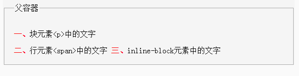
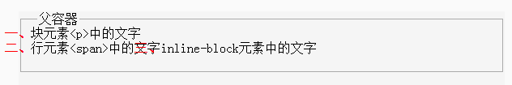
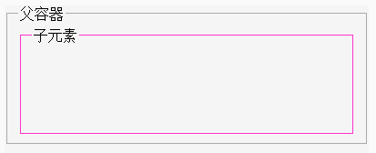
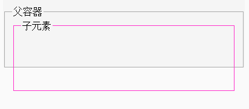
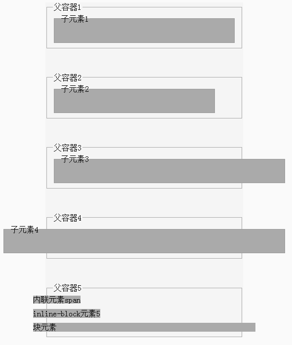
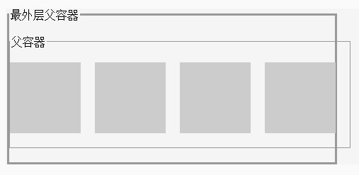
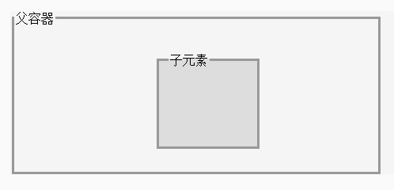

[Back](index.md)

# 负边距的理解

# Introduction

css中的负边距，就是margin的值为负数的意思，它是布局中的一个常用技巧，只要运用得合理常常会有意想不到的效果。很多特殊的css布局方法都依赖于负边距。

# Content Catalogue <a id="≡">≡</a>

- [负边距在普通文档流中的作用和效果](#Tag1)
- [理解负边距的裁减效果](#Tag2)
- [左和右的负边距对元素宽度的影响](#Tag3)
    * [左和右的负边距对元素宽度的影响的应用](#Tag3-1)
- [负边距对绝对定位元素的影响](#Tag4)


# Content

## 负边距在普通文档流中的作用和效果  <a id="Tag1">[≡](#≡)</a>

那些没有脱离文档流的元素（指不是浮动元素也不是绝对定位、固定定位的元素等），其在页面中的位置是跟随者文档流的变化而变化的。请看下面一段Html代码以及对应的效果图（[完整的代码](demos/负边距的理解.html#demo1))：
```
<fieldset style="border:solid 1px #AAAAAA; padding: 20px;">
    <legend>父容器</legend>
    <p>
        <strong style="color:red">一、</strong>块元素&lt;p&gt;中的文字
    </p>
    <span>
        <strong style="color:red">二、</strong>行元素&lt;span&gt;中的文字
    </span>
    <span style="display:inline-block;">
        <strong style="color:red">三、</strong>inline-block元素中的文字
    </span>
</fieldset>
```

 

负边距对这些由文档流控制的元素的作用是，会使它们在文档流中的位置发生偏移，但这种偏移不同于相对定位，通过相对定位偏移后，其仍然会坚守着它原来占据的空间，不会让文档流的其它元素乘虚而入。而通过负边距进行偏移的元素，它会放弃偏移前占据的空间，这样它后面文档流中的其它元素就会“流”过来填充这部分空间。请看下面一段Html代码以及对应的效果图（[完整的代码](demos/负边距的理解.html#demo1))：
```
<fieldset style="border:solid 1px #AAAAAA; padding: 20px;">
    <legend>父容器</legend>
    <p style="margin:-20px 0 0 -40px">
        <strong style="color:red">一、</strong>块元素&lt;p&gt;中的文字
    </p>
    <span style="margin:-20px 0 0 -40px">
        <strong style="color:red">二、</strong>行元素&lt;span&gt;中的文字
    </span>
    <span style="display:inline-block;margin:-20px 0 0 -40px">
        <strong style="color:red">三、</strong>inline-block元素中的文字
    </span>
</fieldset>
```

```
<fieldset style="border:solid 1px #AAAAAA; padding: 20px;">
    <legend>父容器</legend>
    <p style="margin:-20px 0 0 -40px">
        <strong style="color:red">一、</strong>块元素&lt;p&gt;中的文字
    </p>
    <span style="margin:-20px -40px -20px -40px">
        <strong style="color:red">二、</strong>行元素&lt;span&gt;中的文字
    </span>
    <span style="display:inline-block;margin:0">
        <strong style="color:red">三、</strong>inline-block元素中的文字
    </span>
</fieldset>
```

上面这两段Html代码都可以得到下面的效果图，其效果是一样的。

 

上面的第一段Html代码对块状元素、行内元素以及inline-block元素都设一个top负边距-20px和left负边距-40px，可以看到，受到left负边距的影响，本来位于容器内部的元素，已经移位到容器左边界的外面去了，并且inline-block元素的文字与前面一个行元素的末尾重叠在一起了；受top负边距的影响，各元素之间的纵向间距都减小了。

负边距的理解：

- left和top的负边距会使得元素在文档流中的位置发生偏移，并且在偏移后，它原来所占据的空间并不会被保持，而是会被其他元素占用。
- right和bottom的负边距会使得元素所占的区域就像被裁减了一样（虽然被裁减的区域依然显示了该元素的内容），并且其他元素可以占用这部分被裁减的区域。这导致了上面第二个效果图中文字重叠的效果。
- 文档流只能是后面的流向前面的，即文档流只能向左或向上流动，不能向下或向右移动。例如，设置right和bottom的负边距，并不能使得元素本身的位置向左或向上移动（而设置left和top的负边距时将发生这种位移），但是元素的这一部分区域就像被裁减了一样，可以被后面的文档流中的元素所占用。


## 理解负边距的裁减效果  <a id="Tag2">[≡](#≡)</a>

首先来理解一个概念：**_容器的边界_**。

容器的边界，用于界定容器所占的区域，该区域的大小取决于容器的高度和宽度。一个没有设定高度的块状元素，其高度是自动的，并且是由它里面的文档流最后的位置决定的。假设它里面只有一个子元素，高度为100px，那这时这个父元素的高度就等于子元素的高度100px了，如果子元素继续增高，那么父元素也会跟着增高。
对一个子元素设置负边距主要会影响父容器的边界。下面详细解说。

看两段Html代码对应的效果图：   

1. 未设置**_负边距_**时的外部容器与内部块元素：

    Html代码如下（[完整的代码](demos/负边距的理解.html#demo2))：       
    ```
    <fieldset style="border:solid 1px #AAAAAA;">
        <legend>父容器</legend>
        <fieldset style="height:100px; border:solid 1px #F3C">
            <legend>子元素</legend>
        </fieldset>
    </fieldset>
    ```
    效果图如下：          
     

    可以看到，子元素完全位于父容器的边界内部，而子元素的高度也完全决定了父容器的高度。

2. 设置了**_负边距_**时的外部容器与内部元素：

    Html代码如下（[完整的代码](demos/负边距的理解.html#demo2))：       
    ```
    <fieldset style="border:solid 1px #AAAAAA;">
        <legend>父容器</legend>
        <fieldset style="height:100px; border:solid 1px #F3C; margin-bottom:-50px">
            <legend>子元素</legend>
        </fieldset>
    </fieldset>
    ```
    效果图如下：      
    

    可以看到，和第一个不一样的是，子元素并没有完全位于父容器的边界内部，子元素有一部分已经超出了父容器的边界。为什么会发生这种情况呢？这就是因为**_负边距_**在起作用。

    当对一个元素设置right或bottom方向的**_负边距_**时，会使得该元素在**_负边距_**那一侧在父容器中所占的区域像是被裁掉了一部分一样（裁掉的部分与负边距的值相等），因为子元素并不占用被裁掉的区域，这使得父容器的宽度或高度也相应的变小了。由第一节中知道，因为right和bottom方向的负边距并不会使得元素发生位移，所以子元素的内容还是和原来一样，这导致了子元素的底部被才减掉的那部分区域的内容超过了父容器的边界。

    因为父容器的overflow样式默认为visible，所以仍然可以看到该子元素超出父容器边界的那一部分内容，但是由第一节内容可以知道，超出父容器那一部分内容并不占用文档流的空间，所以如果后面还有文档流元素，被裁减的这一部分区域将会重叠展示其他文档流元素的内容。

    如果将父容器的overflow样式设置为hidden，子元素被裁减的那部分内容将会被隐藏。

    总结：
    在文档流中，元素的最终边界是由margin决定的，margin为负的时候就相当于元素的边界向里收，文档流认的只是这个边界，不会管你实际的尺寸是多少。

    负边界裁减效果的应用，可以参考[侧边栏-分栏高度自动相等](侧边栏-分栏高度自动相等.md)一文。

## 左和右的负边距对元素宽度的影响  <a id="Tag3">[≡](#≡)</a>

负边距不仅能影响元素在文档流中的位置，还能增加块元素的宽度！           
这个作用能实现的前提是：该元素没有设定width属性（当然width:auto是可以的）。     
下面是几个展示左右负边距的影响的样例和效果图（[完整的代码](demos/负边距的理解.html#demo3))：
```
<fieldset style="border:solid 1px #AAAAAA;">
    <legend>父容器</legend>
    <fieldset style="height:50px; border:solid 1px #999; background-color: #AAA">
        <legend>子元素</legend>
    </fieldset>
</fieldset>

<fieldset style="border:solid 1px #AAAAAA; margin-top:50px;">
    <legend>父容器</legend>
    <fieldset style="height:50px; border:solid 1px #999; background-color: #AAA;  width:300px; margin-right: -100px;">
        <legend>子元素</legend>
    </fieldset>
</fieldset>

<fieldset style="border:solid 1px #AAAAAA; margin-top:50px;">
    <legend>父容器</legend>
    <fieldset style="height:50px; border:solid 1px #999; background-color: #AAA; width:auto; margin-right: -100px;">
        <legend>子元素</legend>
    </fieldset>
</fieldset>

<fieldset style="border:solid 1px #AAAAAA; margin-top:50px;">
    <legend>父容器</legend>
    <fieldset style="height:50px; border:solid 1px #999; background-color: #AAA; margin-right: -100px; margin-left:-100px;">
        <legend>子元素</legend>
    </fieldset>
</fieldset>
```

效果图：


可以看到：

1. 第二个图在设置了固定宽度的情况下，right的负边距并未对元素的宽度产生影响；
2. 第三个图在设置了宽度为auto的情况下，right的负边距值使得元素的宽度增加了。
3. 第四个图在未设置宽度的情况下，left和right的负边距都使得元素的宽度增加了。
4. 第五个图中，内联元素和inline-block元素的宽度不受left和margin的负边距影响；而块元素p的宽度受到了left和right负边距的影响。

负的margin会改变元素的宽度，这的确很让人费解，如果说负边距会改变元素在文档流中的位置还是很好理解的话，那改变宽度这种现象还真的蛮让人不可思议的。这是为什么呢？


### 左和右的负边距对元素宽度的影响的应用   <a id="Tag3-1">[≡](#≡)</a>

如果想要实现几个元素按顺序横向排列，且元素中间设置固定宽度的间隔的布局要怎么做？如下图所示：


最简单省事的方法就是利用浮动了。只需将父容器的子元素向左浮动，然后设一个合适的margin-right，就OK了。

但因为外层父容器的宽度是固定的，就是里面四个子元素的宽度加上三列间隔的宽度，所以靠近右边边界的子元素就不应该有正向的margin-right了，否则这一行就只能容纳三个子元素了。

有人说那这还不简单，给靠近右边界的那些子元素加一个class，把它的margin-right设为0不就行了。这当然可以，但如果这些子元素是在模板中通过循环动态输出的，那在循环的时候还得判断哪些子元素是靠近右边边界的，如果是就加上一个class。这样做的话是不是就有点麻烦了？

所以解决办法是加大父容器的宽度，让它能够容纳一行中有四个子元素加上四列间隔的宽度，然后外层父容器的那个容器设一个overflow:hidden就行了。上面说了负的左右边距能加大元素的宽度，所以给子元素的父容器设一个合适的负的margin-right就可以了。当然你也可以直接在css中把父容器的宽度设宽一些，举这个例子只是为了说明负边距也是一种方法。下面是实现代码（[完整的代码](demos/负边距的理解.html#demo4))：
```
<fieldset style="width:460px; border:solid 3px #999; padding:0; overflow:visible;">
    <legend>最外层父容器</legend>
    <fieldset style="margin:20px -22px 20px 0; padding:20px 0; border:solid 1px #999;">
        <legend>父容器</legend>
        <div style="float:left; width:100px; height:100px; background-color:#CCC; margin-right:20px;"></div>
        <div style="float:left; width:100px; height:100px; background-color:#CCC; margin-right:20px;"></div>
        <div style="float:left; width:100px; height:100px; background-color:#CCC; margin-right:20px;"></div>
        <div style="float:left; width:100px; height:100px; background-color:#CCC; margin-right:20px;"></div>
    </fieldset>
</fieldset>
```


## 负边距对绝对定位元素的影响   <a id="Tag4">[≡](#≡)</a>

绝对定位的元素定义的top、right、bottom、left等值是元素自身的边界到最近的已定位的祖先元素的距离，这个元素自身的边界指的就是margin定义的边界，所以，如果margin为正的时候，那它的边界是向外扩的，如果margin为负的时候，则它的边界是向里收的。利用这点，就有了经典的利用绝对定位来居中的方法，请看下面的Html代码和效果图（[完整的代码](demos/负边距的理解.html#demo5))：     
```
<fieldset style="width:460px; height:200px; border:solid 3px #999; padding:0; position:relative;">
    <legend>父容器</legend>
    <fieldset style="width:100px; height:100px; position:absolute; left:50%; top:50%; margin-left:-50px; margin-top:-50px; border:solid 3px #999; background-color:#DDD">
        <legend>子元素</legend>
    </fieldset>
</fieldset>
```

效果图：
