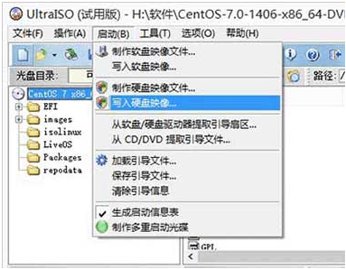
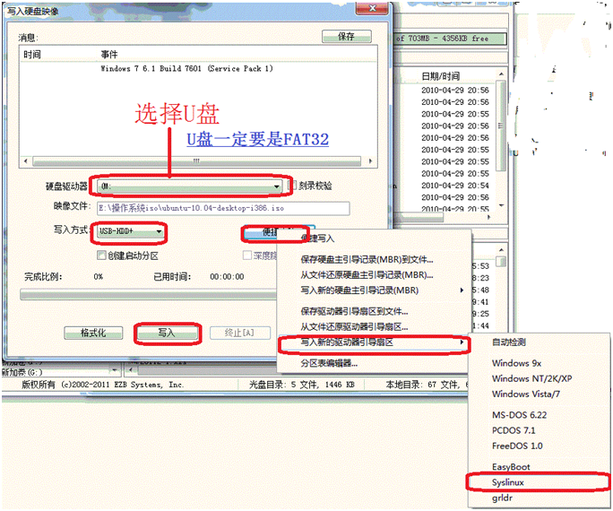
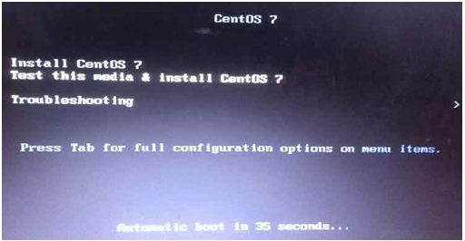
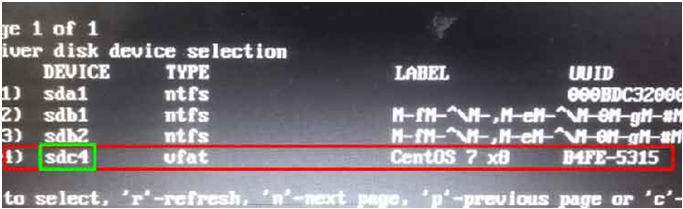

[Home](../../index.md) >> [Articles](../index.md) >> [Linux](index.md)

### Linux System Installation

#### CentOS Installation (The same as RHEL)

##### 使用USB安装CentOS

	下面以CentOS 7为例，讲解如何使用USB制作Linux的安装盘，并进行安装。

1. Windows下制作USB安装盘

	1. 下载Linux的ISO文件

	2. 确保USB的格式为FAT32

	3. 使用最新版本的UltraISO刻录IOS镜像到USB，步骤如下：
		1. 打开安装好的UltraISO，在【文件】主菜单中选择【打开】菜单，选择本次要刻录的ISO镜像文件；

		2. 选择【启动】主菜单下的【写入硬盘映像】，如下所示：
			

		3. 此时，将打开如下所示的对话框，在对话框中的“硬盘驱动器”一栏选择要刻录到的USB盘符，“写入方式”选择“USB-HDD+”，“便捷启动”一项选择“Syslinux”。填写完毕后点击【写入】按钮即可。
			

2. 使用USB引导安装Linux系统

	1. 电脑开机进BIOS修改系统启动的引导顺序为USB引导。

	2. 重启后，电脑将从USB引导启动，进入如下界面：
		

	3. 修改引导选项。

		因为系统默认的并不是从USB加载系统安装文件，必须通过手动修改安装选项来指定，但是，你可能并不知道USB的盘符是什么，这需要通过以下操作来查看：

		1. 首先移动上下箭头，确保选中了“Install CentOS 7”一项

		2. 然后按TAB键，安装界面将弹出一行安装选项的文字，如下面所示：
			`vmlinuz initrd=initrd.img inst.stage2=hd:LABEL=CentOS\x207\x28x84_64   quiet`
		上面的inst.stage2一项是指定系统安装文件所在的分区。如果此时你并不知道USB所在的盘符具体是多少，此时，你可以通过修改上面的内容来进行查看，修改方式如下：
			`vmlinuz initrd=initrd.img linux dd   quiet`
		修改完后按回车，系统将重启，等待一会将看到如下界面：
			
		从上面可以很容易分辨出最后一个是USB的盘符，此时你需要记住如上面所示的盘符“sdc4”，然后按 ctrl + alt + delete重启电脑

		3. 等再次进入上面的安装界面后，重复最开始的操作（即选中“Install CentOS 7”一项，然后按TAB键），并将安装选项修改为如下内容（注意，下面的sdc4需要根据实际的USB盘符来填写）：
			`vmlinuz initrd=initrd.img inst.stage2=hd:/dev/sdc4   quiet`

		4. 然后按回车，就可以进入正常的Linux安装界面了。下面的安装跟普通的安装过程一样

