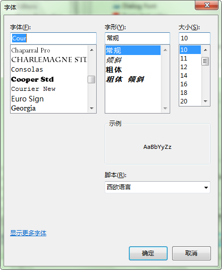

[Back](index.md)

# Introduction

记录Eclipse开发环境的配置。

# Content Catalogue <a id="≡">≡</a>

- [文本编辑器字体设置](#EFS)
    * [通用设置](#EFS-CS)
    * [特定文件编辑器的字体设置](#EFS-SS)
    * [字体的选择](#EFS-FS)
        + [Courier New字体](#EFS-FS-CN)
        + [YaHei Consolas Hybrid](#EFS-FS-YCH)

# Content

## 文本编辑器字体设置  <a id="EFS">[≡](#≡)</a>

Eclipse即可以针对所有类型的文件（如Java、Javascript）设置公用的字体，也可以单独针对某一种类型的文件单独进行设置。

### 通用设置 <a id="EFS-CS">[≡](#≡)</a>

依次选择     
`Windows/Preferences/General/Appearance/Colors and Fonts/Basic/Text Font`   
然后选中右边的 "Edit" 按钮即可打开字体设置对话框，并对通用的字体进行修改。

### 特定文件编辑器的字体设置 <a id="EFS-SS">[≡](#≡)</a>

这里以Java文件编辑器的字体设置为例，其他的类似，一次选择：    
`Windows/Preferences/General/Appearance/Colors and Fonts/Java/Java Editor Text Font`    然后选中右边的 "Edit" 按钮即可打开字体设置对话框，并对Java文件编辑器的字体进行修改。

### 字体的选择 <a id="EFS-FS">[≡](#≡)</a>

Eclipse默认使用"Consolas"字体，这种字体的缺点是，中文字体显示比英文字体要小，中英文混排时比较难看。     

比较好看的字体包括：  

#### Courier New字体 <a id="EFS-FS-CN">[≡](#≡)</a>
该字体一般系统默认安装了，但是可能在Eclipse的字体选择列表中看不到，因为该字体可能未被启用。只需启用一下该字体即可。方法如下：
1. 打开字体设置对话框，如下图所示：
    
2. 选择左下角的"显示更多字体"，打开系统控制面板中的字体项，如下图所示：
    
3. 找到Courier New字体文件，并双击打开，可以看到里面有四种Courier New字体，并且呈现灰色（灰色表示未启用）。如下图所示：
    
4. 在"Courier New 常规"字体文件上单击右键，并选择"显示"菜单，稍后，该字体文件将有 _灰色_ 更新为 _深色_（表示已激活）。
5. 回到Eclipse的字体设置对话框，并将其关闭然后重新打开，此时即可看到字体选择列表中有"Courier New"字体了。          

#### YaHei Consolas Hybrid <a id="EFS-FS-YCH">[≡](#≡)</a>     

该字体为第三方字体，系统未默认安装，需要手动安装字体，安装完成后，后续的字体设置步骤跟"Courier New"字体设置的步骤一样。
要安装该字体，首先要下载该字体文件，这里保存了一份副本[YaHei.Consolas.1.12.zip](attachments/YaHei.Consolas.1.12.zip)，然后解压缩后，直接将字体安装文件（扩展名为.ttf）拷贝到 “系统控制面板\外观和个性化\字体” 中即可。
